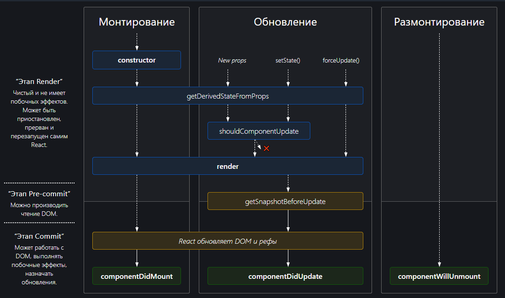

# Class Components: React.Component & React.PureComponent 

***React.Component*** — это базовый класс для компонентов React, объявленных как ES6-классы.
React.Component не реализует ```shouldComponentUpdate()``` 

***React.PureComponent*** похож на React.Component. Отличие заключается в том, 
React.PureComponent реализует ```shouldComponentUpdate()``` 
поверхностным сравнением пропсов и состояния.

Если метод ```render()``` вашего React-компонента всегда рендерит одинаковый результат 
при одних и тех же пропсах и состояниях, для повышения производительности в некоторых 
случаях вы можете использовать React.PureComponent.

Пропускает обновление пропсов для всего поддерева компонентов. 
Убедитесь, что все дочерние компоненты также являются «чистыми».

[docs](https://ru.reactjs.org/docs/react-api.html):
- [React.Component](https://ru.reactjs.org/docs/react-api.html#reactcomponent)
- [React.PureComponent](https://ru.reactjs.org/docs/react-api.html#reactpurecomponent)
- [React.memo](https://ru.reactjs.org/docs/react-api.html#reactmemo)
```
    const MyComponent = React.memo(function MyComponent(props) {
      /* рендер с использованием пропсов */
    });
```
Если компонент всегда рендерит одно и то же при неменяющихся пропсах, можете обернуть его в вызов
React.memo для повышения производительности в некоторых случаях, мемоизируя тем самым результат.
Это значит, что React будет использовать результат последнего рендера, избегая повторного рендеринга.

-------

## [React Lifecycle](https://projects.wojtekmaj.pl/react-lifecycle-methods-diagram/

### 1) Mounting lifecycle:
- constructor()
    * Инициализация внутреннего состояния через присвоение объекта ```this.state = { counter: 0 }```
    * Привязка обработчиков событий к экземпляру ```handleClick = () => { console.log('значение this:', this) }```
- getDerivedStateFromProps()
    * Должен вернуть объект для обновления состояния или null, чтобы ничего не обновлять
    * Для редких случаев, когда состояние зависит от изменений в пропсах
    * Производное состояние приводит к сложному коду и делает компоненты сложными для понимания
- render()
    * При вызове он проверяет ```this.props``` и ```this.state``` и возвращает DOM-узел или пользовательский компонент
    * Должна быть чистой, не изменяя состояния компонента, всегда возвращая один и тот же результат 
    * Не взаимодействует напрямую с браузером
- componentDidMount()
    * Взаимодействует с браузером
    * Вызывается сразу после монтирования (то есть, вставки компонента в DOM)
    * Это хорошее место для создания сетевых запросов

### 2) Updating lifecycle:
- shouldComponentUpdate()
    * Используется для указания необходимости следующего рендера на основе изменений состояния и пропсов
    * Вызывается перед рендером, когда получает новые пропсы или состояние
    * Не вызывается при первом рендере или когда используется ```forceUpdate()```
    * Этот метод нужен только для повышения производительности
    * Возврат false не предотвращает повторный рендер дочерних компонентов при изменении их состояния
    * В будущем React => возврат false сможет привести к повторному рендеру компонента
- render()
- getSnapshotBeforeUpdate()
    * Вызывается прямо перед этапом «фиксирования» (например, перед добавлением в DOM)
    * Позволяет компоненту брать информацию из DOM (например, положение прокрутки) перед её возможным изменением
- componentDidUpdate()
    * Вызывается сразу после обновления. Не вызывается при первом рендере
    * Подходит для выполнения таких сетевых запросов, которые выполняются на основании 
        результата сравнения текущих пропсов с предыдущими
    * Если пропсы не изменились, новый запрос может и не требоваться

### 3) Unmounting lifecycle:
- componentWillUnmount()
    * Этот метод вызывается при удалении компонента из DOM
    * Выполняется необходимый сброс: отмена таймеров, сетевых запросов и подписок, созданных в ```componentDidMount()```

-------

- 
- 


1) React.Component:
```
    shouldComponentUpdate() {
     return true;
    }
```

2) React.PureComponent
```
    shouldComponentUpdate(nextProps, nextState) {
     return !shallowEqual(nextProps, this.props) || !shallowEqual(nextState, this.state);
    }
```

PureComponent изначально определяет функцию, которая ответственна за принятие решения —
нужно ли продолжать updating lifecycle или нет.

PureComponent помогает сократить число операций и оптимизировать рендер.

-------


-------


